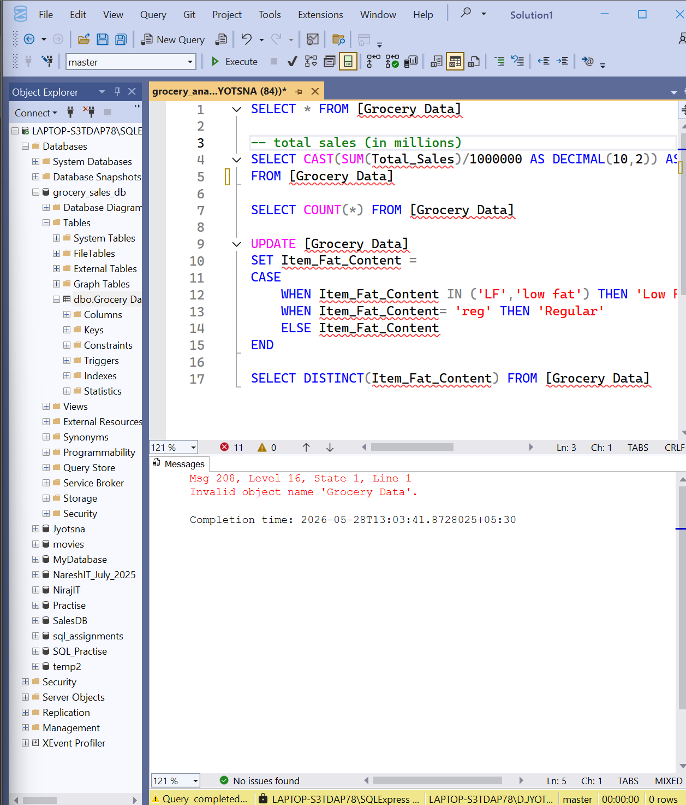
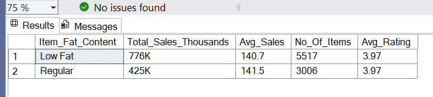
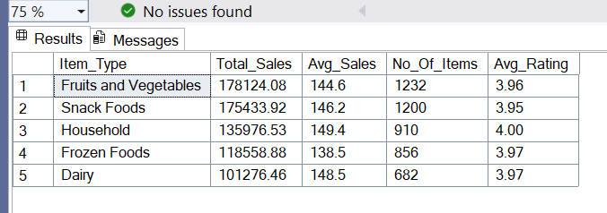

# Grocery-Sales-SQL-Analysis-
Exploratory Data Analysis (EDA) of retail grocery sales and inventory volume using Microsoft SQL Server (SSMS). Implements data cleaning, matrix pivots, and window functions to extract business intelligence.

# 🛒 Grocery Retail Analytics: Revenue & Inventory EDA

An end-to-end Exploratory Data Analysis (EDA) project leveraging **Microsoft SQL Server (SSMS)** to extract actionable business insights from an 8,500+ record grocery retail database.

---
## Project Overview
The **Grocery Sales Analysis Project** is an end-to-end database exploration suite designed to **turn raw transactional grocery delivery rows into structured business intelligence**. 

This repository demonstrates the systematic progression of a data analytics workflow—starting from initial database structural inspection and text standardization to building complex matrix configurations and analytical window calculations.

Key highlights include:
* **Data Cleansing**: Standardizing unstructured, fragmented text variables (`'LF'`, `'low fat'`, `'reg'`) into consistent corporate indicators.
* **Granular Segmentation**: Evaluating product category performance footprints by grouping core items by overall revenue generation.
* **Matrix Restructuring**: Utilizing nested subqueries and dynamic `PIVOT` operators to map product performance across geographical regional tiers.
* **Strategic Window Calculations**: Deploying partitionless window functions (`OVER()`) to calculate the exact percentage contribution of different store layout attributes to global corporate revenue.

This project showcases **core relational database analytics skills**: from optimizing data hygiene anomalies to implementing intermediate-to-advanced analytical reporting steps that make data clear for executive decision-makers.

---
## Business Problem
A fast-growing retail grocery platform handles thousands of on-demand product configurations across multiple physical layouts and geographic tiers. With raw operational data pouring in from fragmented interfaces, business stakeholders face significant hurdles:
* **Data Inconsistency**: Core categorical values (like item fat content classifications) contain inconsistent data naming conventions, breaking automated summary analytics.
* **Performance Visibility**: Executive managers cannot easily extract a macro view of performance trends across varying store sizes and regional types simultaneously.
* **Hidden Revenue Drivers**: High-margin product segments and regional market shares remain trapped inside single-row transaction line items, delaying strategic shelf inventory shifts.

Without a centralized, optimized SQL profiling script, these critical business parameters remain buried, forcing the company to rely on slow, manual sorting methods.

---

## Objectives
The core objectives of this data analytics suite were to:
1. **Establish Data Hygiene**: Scan and clean irregular database string text inputs to build a unified single version of truth.
2. **Quantify Global Baseline Performance**: Extract core foundational KPIs including gross revenue totals, volume counts, and customer feedback trends.
3. **Build Structural Matrix Snapshots**: Leverage advanced multi-layer relational calculations (`PIVOT` operations) to format multidimensional operational reports.
4. **Determine Market Share Footprints**: Run deep-dive partitions using window functions to figure out the exact percentage value distribution across retail layouts.

---

## Key Performance Indicators (KPIs)
To provide an immediate high-level dashboard snapshot for a business head, the project highlights four core metrics:
* **Total Global Sales** – The global incoming revenue baseline scaled and formatted in Millions (`M`).
* **Average Sales Value** – General performance indicator measuring average baseline basket size.
* **Total Items Count** – The global count of unique product orders handled across the database network.
* **Average Product Rating** – Customer satisfaction benchmark used to track quality control metrics.

---

## Disclaimer
This project is created strictly for educational, portfolio, and learning practice purposes. The underlying dataset and SQL queries are simulated for analytics training and do not represent real or confidential corporate records of any specific retail brand.

---

## Tools & Techniques Used
* **Microsoft SQL Server (MS SQL)** – Relational database infrastructure framework.
* **SQL Server Management Studio (SSMS)** – Query building workspace environment.
* **Data Type Precision (`CAST`)** – Tweaking raw values into clean decimals or whole integers for clean reports.
* **Conditional Logic (`CASE WHEN`)** – Mapping and modifying records during the data cleaning sweep.
* **Relational PIVOT Transformations** – Reshaping rows into clean multi-column comparative matrices.
* **Analytical Window Calculations (`OVER()`)** – Computing grand totals across group segments without collapsing raw records.

---
## Detailed Analysis & Calculations

### Phase 1: Data Cleaning & Standardization

Before extracting metrics, the query suite runs a baseline check on the dataset and standardizes irregular text variations inside the categorical field to guarantee absolute consistency.

```sql
USE grocery_sales_db;

-- 1. Baseline dataset observation
SELECT * FROM [Grocery Data];

```
Verifies the total row count of the imported dataset to ensure all records loaded successfully from the raw data source.

```sql
-- 2. Standardize text inconsistencies in categorical columns
UPDATE [Grocery Data]
SET Item_Fat_Content = 
    CASE 
        WHEN Item_Fat_Content IN ('LF', 'low fat') THEN 'Low Fat'
        WHEN Item_Fat_Content = 'reg' THEN 'Regular'
        ELSE Item_Fat_Content
    END;
```
Cleans the entry data by collapsing redundant variables ('LF', 'low fat', and 'reg') into two standardized enterprise categories: 'Low Fat' and 'Regular'.

```sql
-- 3. Post-cleaning column validation check
SELECT DISTINCT Item_Fat_Content FROM [Grocery Data];
```
Executes a distinct scan across the column to confirm all variations have been successfully overwritten into the two official structural categories.

### Phase 2: Global Key Performance Indicators (KPIs)
These queries run global aggregations to establish baseline financial benchmarks and consumer engagement indicators for executive overview cards.

1. Total Global Sales (Formatted in Millions)
Aggregates total transaction sales across all store regions and scales the large raw integer down to millions with a text suffix for immediate corporate reporting.
```sql
-- 1. Total Global Sales (Formatted in Millions)
SELECT CONCAT(CAST(SUM(Total_Sales)/1000000.0 AS DECIMAL(10,2)), 'M') AS Total_Sales_Millions
FROM [Grocery Data];

-- 2. Performance Tracking: Total Sales for 2022 Cohort Stores
SELECT CONCAT(CAST(SUM(Total_Sales)/1000000.0 AS DECIMAL(10,2)), 'M') AS Total_2022_Sales
FROM [Grocery Data]
WHERE Outlet_Establishment_Year = 2022;

-- 3. Operational Performance: Average Transaction Value
SELECT CAST(AVG(Total_Sales) AS DECIMAL(10,1)) AS Avg_Sales
FROM [Grocery Data];

-- 4. Inventory Volume: Global Distinct Item Records Count
SELECT COUNT(*) AS Total_No_Of_Items
FROM [Grocery Data];

-- 5. Operational Volume: Total Items Tracked for 2022 Cohort
SELECT COUNT(*) AS No_Of_Items_2022
FROM [Grocery Data]
WHERE Outlet_Establishment_Year = 2022;

-- 6. Customer Satisfaction: Average Overall Product Rating
SELECT CAST(AVG(Rating) AS DECIMAL(10,1)) AS Avg_Rating
FROM [Grocery Data];

```



### Phase 3: Granular Segmentation & Business Deep-Dives
**A. Total Sales Distribution by Fat Content**  
Profiles how raw monetary revenue behaves when split across core product fat attributes.
```sql
SELECT Item_Fat_Content, 
    CONCAT(CAST(SUM(Total_Sales)/1000.0 AS DECIMAL(10,0)), 'K') AS Total_Sales_Thousands,
    CAST(AVG(Total_Sales) AS DECIMAL(10,1)) AS Avg_Sales,
    COUNT(*) AS No_Of_Items, 
    CAST(AVG(Rating) AS DECIMAL(10,2)) AS Avg_Rating
FROM [Grocery Data]
GROUP BY Item_Fat_Content
ORDER BY Total_Sales_Thousands DESC;
```


**B. Total Sales Performance by Item Type Category**  
Isolates individual product lines sorted from highest performing to lowest to streamline shelf inventory space.
```sql
-- B. Product Analysis: Top 5 Highest Performing Item Categories (FIXED SORT)
SELECT TOP 5 Item_Type,
    CAST(SUM(Total_Sales) AS DECIMAL(10,2)) AS Total_Sales,
    CAST(AVG(Total_Sales) AS DECIMAL(10,1)) AS Avg_Sales,
    COUNT(*) AS No_Of_Items, 
    CAST(AVG(Rating) AS DECIMAL(10,2)) AS Avg_Rating    
FROM [Grocery Data]
GROUP BY Item_Type
ORDER BY Total_Sales DESC; -- Fixed from ASC to capture true top performers
```



